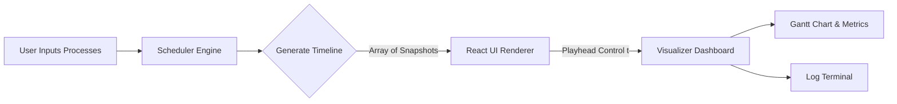

# ⚙️ CPU Scheduling Simulator & Visualizer

### Developed by **Dipanshu Bansal**  
*Student at NIT Jalandhar | Full Stack Developer | Tech Enthusiast*

An **interactive, premium visualization tool** designed to model, scrub, and analyze CPU scheduling algorithms in real-time. This project features a clean separation between scheduling logic and UI rendering, acting as an educational aid and a high-caliber addition to a technical resume.

🚀 **Live Interactive Playback:** Drag the slider to scrub through time and watch CPU state changes, ready queue queues, and the Gantt chart update dynamically!

---

## 🧠 Architectural Overview (Separation of Concerns)

Unlike typical simulation projects that mix UI rendering and state calculation within asynchronous timers, this project is built on clean software engineering principles:



### 1. The Core Engine (`schedulerEngine.js`)
All scheduling algorithms are implemented as **pure JavaScript functions**. The engine takes the input process list and runs the simulation synchronously, outputting a complete `timeline` array of snapshots for every second `t`. Each snapshot records:
* Which process is occupying the CPU.
* The exact order of processes waiting in the `readyQueue`.
* Remaining execution times for all jobs.
* Completed processes up to that second.
* Decision engine events (e.g., preemption notifications, arrivals, context switches).

*Benefit:* Separating this algorithm logic from React makes it **100% testable**, **deterministic**, and **free from async race conditions**.

### 2. The Interactive Visualizer (`Visualizer.jsx`)
The UI is driven entirely by the `currentTime` playhead state. As the user scrubs the slider or presses Play:
* The UI reads the corresponding snapshot from the timeline.
* The Gantt chart dynamically constructs and shrinks/grows according to the current timestamp.
* The terminal logs scroll reactively to explain scheduler choices at that exact millisecond.

---

## 🧩 Implemented Algorithms

1. **First Come First Serve (FCFS)**
   * *Type:* Non-preemptive.
   * *Logic:* Executes processes strictly in order of arrival.
   * *Interview Talking Point:* Easy to implement, but prone to the **Convoy Effect** (short jobs wait behind a massive long job).
2. **Shortest Job First (SJF)**
   * *Type:* Non-preemptive.
   * *Logic:* Picks the arrived process with the shortest burst time.
   * *Interview Talking Point:* Mathematically optimal for minimizing average waiting time, but can cause **starvation** for long jobs.
3. **Shortest Remaining Time First (SRTF / SRJF)**
   * *Type:* Preemptive.
   * *Logic:* At each tick, preempts the CPU if an arrived process has a shorter remaining burst time than the running process.
4. **Round Robin (RR)**
   * *Type:* Preemptive.
   * *Logic:* Allocates CPU to ready queue jobs in FIFO order for a fixed time unit called **Time Quantum**.
   * *Interview Talking Point:* Highly responsive for time-sharing systems. Selecting the right quantum is critical (too small = high context switch overhead; too large = behaves like FCFS).
5. **Priority Scheduling (Non-Preemptive)**
   * *Type:* Non-preemptive.
   * *Logic:* Allocates CPU based on priority rank (lower integer value = higher priority).
6. **Priority Scheduling (Preemptive)**
   * *Type:* Preemptive.
   * *Logic:* Preempts current execution immediately if a higher-priority process arrives.

---

## ⚡ Key Features

* **Timeline Scrubbing:** A range slider that lets you scrub backwards and forwards through the entire execution timeline.
* **Microprocessor CPU Core Visual:** A pulsing central CPU processor dashboard showing active progress bars and quantum timers.
* **Event Logger Terminal:** A hacker-style log panel that explains the algorithmic reason behind every scheduling decision.
* **Responsive Performance Metrics:** Real-time averages for Turnaround Time (TAT) and Waiting Time (WT), alongside detailed process statistics tables.
* **Modern Glassmorphic Dark UI:** Designed with frosted-glass containers, vibrant process neon tags, and smooth animations powered by Tailwind CSS v4.

---

## 🛠 Installation & Setup

Ensure you have [Node.js](https://nodejs.org/) installed.

### 1. Clone the repository
```bash
git clone https://github.com/DIPANSHU66/scheduling-algo.git
```

### 2. Enter project folder
```bash
cd scheduling-algo
```

### 3. Install packages
```bash
npm install
```

### 4. Start Development Server
```bash
npm run dev
```

---

## 🎓 Recruiter & Interview Cheat Sheet (Q&A)

Prepare for your OS interview questions with these quick-answers based on this simulator:

**Q: What is the Convoy Effect in FCFS?**  
*A:* When a single heavy CPU-bound process occupies the CPU, several small I/O-bound processes arrive and must wait in the ready queue. This results in poor CPU utilization and long average waiting times.

**Q: How do you solve starvation in Priority Scheduling?**  
*A:* Starvation (where a low-priority job waits indefinitely) is solved using **Aging**, which gradually increases the priority of processes that wait in the ready queue for long periods.

**Q: Why is SRTF difficult to implement in real operating systems?**  
*A:* Because it is extremely difficult for an OS to know the exact **future burst time** of a process. Systems must instead *estimate* burst times using historical exponential averaging.

## 🧰 Tech Stack

- **Frontend:** React (Vite)
- **Styling:** Tailwind CSS v4
- **Icons:** Lucide React
- **Visualization:** Custom simulation engine with interactive range scrubbing, dynamic Gantt charts, and scroll-locked live logs.

## 🤝 Contributing

Contributions are welcome!
If you’d like to enhance the visualization or add more algorithms, follow these steps:

1. **Fork** the repository
2. **Create a new branch**
   ```bash
   git checkout -b feature-name
   ```
3. **Make your changes** and commit them
   ```bash
   git commit -m "Added advanced scheduling animation"
   ```
4. **Push the branch**
   ```bash
   git push origin feature-name
   ```
5. **Create a pull request**

---

## 👨‍💻 Author

**Dipanshu Bansal**  
Student at **NIT Jalandhar** | Full Stack Developer | Tech Enthusiast  
📧 Email: [dipanshu6bansal@gmail.com](mailto:dipanshu6bansal@gmail.com)  
🌐 GitHub: [github.com/DIPANSHU66](https://github.com/DIPANSHU66)

⭐ *If this project helped you understand operating systems scheduling, please star the repository!*
