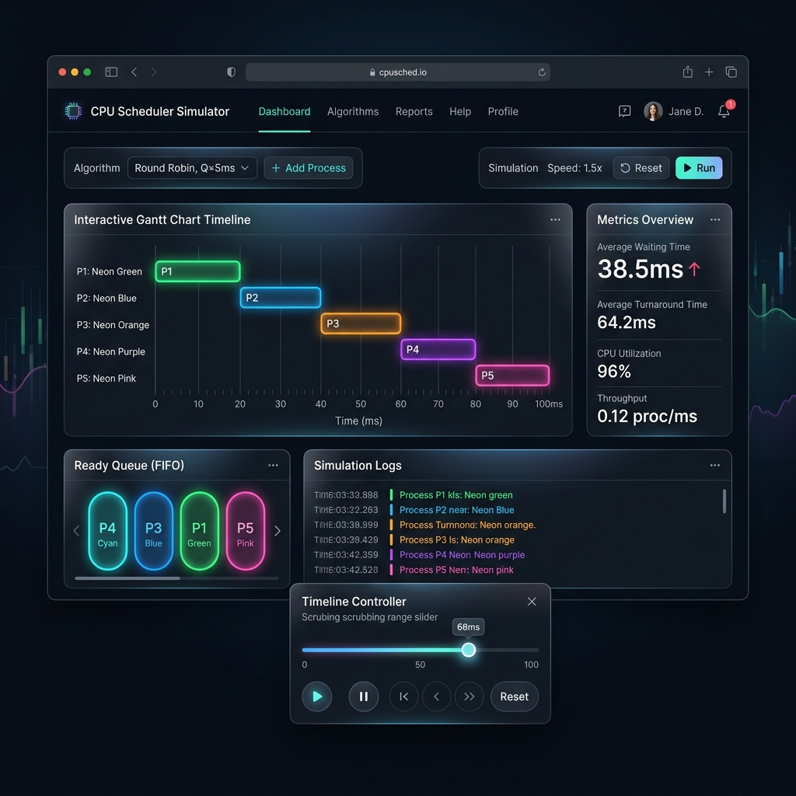
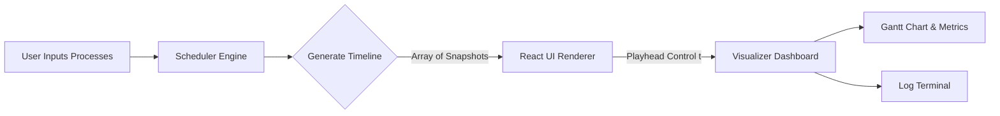

# ⚙️ CPU Scheduling Simulator & Visualizer

[](https://react.dev/)
[](https://vite.dev/)
[](https://tailwindcss.com/)
[](https://lucide.dev/)

An interactive, premium visualization dashboard designed to simulate, scrub, and analyze operating system CPU scheduling algorithms in real-time. Built with a clean separation between algorithmic execution and stateful rendering.

---

## 🖥️ Application Preview



---

## 🧠 Architectural Overview (Separation of Concerns)

Unlike typical simulation projects that mix UI rendering and state calculation within asynchronous timers, this project is built on clean software engineering principles:



### 1. The Core Engine (`schedulerEngine.js`)
All scheduling algorithms are implemented as **pure JavaScript functions**. The engine takes the input process list and runs the simulation synchronously, outputting a complete `timeline` array of snapshots for every second `t`. Each snapshot records:
- Which process is occupying the CPU.
- The exact order of processes waiting in the `readyQueue`.
- Remaining execution times for all jobs.
- Completed processes up to that second.
- Decision engine events (e.g., preemption notifications, arrivals, context switches).

*Benefit:* Separating this algorithm logic from React makes it **100% testable**, **deterministic**, and **free from async race conditions**.

### 2. The Interactive Visualizer (`Visualizer.jsx`)
The UI is driven entirely by the `currentTime` playhead state. As the user scrubs the slider or presses Play:
- The UI reads the corresponding snapshot from the timeline.
- The Gantt chart dynamically constructs and adjusts according to the current timestamp.
- The terminal logs scroll reactively to explain scheduler choices at that exact millisecond.

---

## 🧩 Implemented Algorithms

1. **First Come First Serve (FCFS)**
   - *Type:* Non-preemptive.
   - *Logic:* Executes processes strictly in order of arrival.
   - *Interview Highlight:* Simple to design, but susceptible to the **Convoy Effect** (short jobs blocked behind long-running processes).
2. **Shortest Job First (SJF)**
   - *Type:* Non-preemptive.
   - *Logic:* Selects the arrived process with the shortest burst time.
   - *Interview Highlight:* Minimizes average waiting time but can cause **starvation** for processes with large burst times.
3. **Shortest Remaining Time First (SRTF / SRJF)**
   - *Type:* Preemptive.
   - *Logic:* Preempts the CPU if a newly arrived process has a shorter remaining burst time than the current executing job.
4. **Round Robin (RR)**
   - *Type:* Preemptive.
   - *Logic:* Cycles CPU allocation in FIFO order for a fixed unit called the **Time Quantum**.
   - *Interview Highlight:* Essential for time-sharing systems. The quantum selection is critical (too small causes high context-switch overhead; too large converts it to FCFS).
5. **Priority Scheduling (Preemptive & Non-Preemptive)**
   - *Type:* Preemptive / Non-preemptive.
   - *Logic:* Allocates CPU based on priority levels (lower values = higher priority).

---

## ⚡ Key Features

- **Timeline Scrubbing:** Slide backwards and forwards in time to scrub execution state dynamically.
- **Pulsing CPU Core Visual:** Dashboard showing active core indicators, progress bars, and active quantum timers.
- **Decision Log Terminal:** A styled logs console detailing the scheduler's algorithmic choices at each event.
- **Performance Analysis Metrics:** Real-time calculation of Turnaround Time (TAT), Waiting Time (WT), and averages.
- **Glassmorphic UI Design:** Designed with translucent frosted containers, neon tag indicators, and animated layouts using Tailwind CSS v4.

---

## 🚀 Local Installation & Setup

### Prerequisites
- [Node.js](https://nodejs.org/) installed

### Step-by-Step Setup
1. Clone the repository:
   ```bash
   git clone https://github.com/DIPANSHU66/scheduling-algo.git
   ```
2. Navigate to the project root directory:
   ```bash
   cd scheduling-algo
   ```
3. Install dependencies:
   ```bash
   npm install
   ```
4. Start the local development server:
   ```bash
   npm run dev
   ```

---

## 🎓 Recruiter & Interview Cheat Sheet (Q&A)

Prepare for OS interview questions using this simulator as reference:

- **Q: What is the Convoy Effect in FCFS?**  
  *A:* When a heavy CPU-bound process runs, small I/O-bound processes must wait in the ready queue. This leads to poor CPU resource utilization and long waiting times.
- **Q: How do you solve starvation in Priority Scheduling?**  
  *A:* Starvation (where a low-priority job waits indefinitely) is solved using **Aging**, which incrementally raises the priority of waiting processes over time.
- **Q: Why is SRTF difficult to implement in real operating systems?**  
  *A:* An OS cannot perfectly predict **future burst times**. Systems must estimate burst times using historical exponential averaging models.

---

## 🛡️ License & Contributions
This project is open-source. Contributions, issues, and feature requests are welcome!

---

*Made with ❤️ by [Dipanshu Bansal](https://github.com/DIPANSHU66)*
